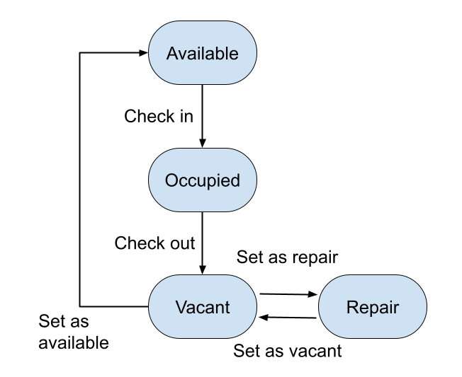

# Question 1

## Room State Graph

## Usage

* Hotel starts with all rooms available.

* Enter '1' to check in to the nearest room assigned by the program.

* Enter '2' to check out of a room (room name input required).

* Enter '3' to set a vacant room to available (room name input required).

* Enter '4' to set a vacant room for repair (room name input required).

* Enter '5' to set room from repair to vacant (room name input required).

* Program prohibits invalid state changes.